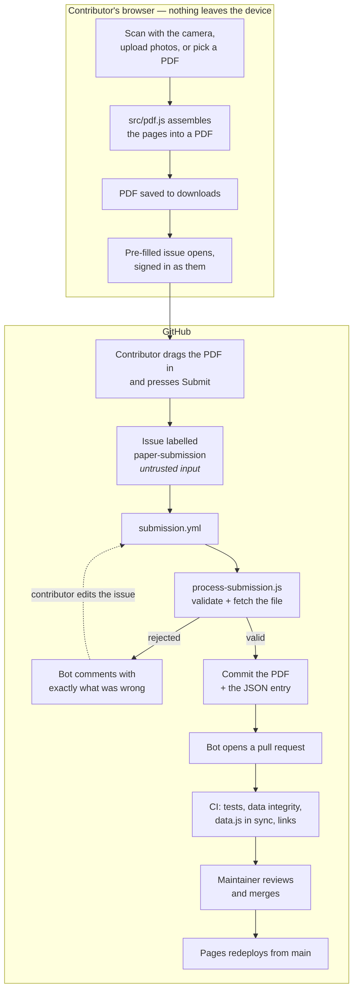

# college-materials

Open study materials for Manipal University Jaipur, maintained by
[Accelerate](https://github.com/accelerate-muj) and contributed by students. Everything here is a
file in a public Git repository — no login, no ads, no upload quota, nothing that expires when
somebody's Drive fills up.

**Browse it: [accelerate-muj.github.io/college-materials](https://accelerate-muj.github.io/college-materials/)**

## What's here

### Past Year Question Papers

Mid-term and end-term papers, organised the way you'd actually look for them — programme, then
year of study, then specialisation.

Every programme MUJ runs, not just B.Tech: BBA, BCA, B.Des, LLB, B.Arch, BHM, BPES and the rest —
23 programmes across 10 faculties, 124 collections in total.

| Level | Example | Notes |
|---|---|---|
| Programme | `btech`, `bba`, `bpes` | Grouped by faculty on the landing screen |
| Year | `year-1` … `year-5` | Each programme runs to its own length; year N covers semesters 2N−1 and 2N |
| Specialisation | `cse-aiml`, `fashion`, `common` | Only where the programme splits. B.Tech has 15; most programmes have none, and file under `common` |

B.Tech's first year is common to every branch, so it files under `btech/year-1/common` rather than
once per branch.

**[Open the archive →](https://accelerate-muj.github.io/college-materials/pyq/)**

### Adding a paper

**[Open the scanner](https://accelerate-muj.github.io/college-materials/pyq/add/)** — photograph the
paper with your phone or upload one you already have, fill in three fields, and press submit. The
PDF is assembled in your browser; a bot commits it and opens a pull request for a maintainer to
review. A GitHub account is the only requirement.

Doing it by hand is still a single JSON entry — see [CONTRIBUTING.md](CONTRIBUTING.md).

## Running it locally

Double-click `index.html`. There is no build step and nothing to install.

The one thing that needs Node is regenerating the archive after you edit the data:

```bash
node build.js                            # data/pyq/ -> pyq/data.js
node .github/scripts/validate-data.js    # the same check CI runs
node tests/run.js                        # no npm install — there are no dependencies
node build-fonts.js                      # only if you changed a font file
```

No Node? The test suite also runs by opening `tests/index.html` in a browser, and the club's
[Git guide](https://accelerate-muj.github.io/resources/git-guide/) covers the rest.

## Layout

```
index.html               Landing page
style.css                The design system, applied — see DESIGN.md
pyq/
  index.html             The archive: programme -> year -> specialisation -> papers
  app.js                 Hash routing and rendering
  data.js                Generated — the baked archive the page reads (window.PYQ_DATA)
  add/                   The scanner: camera, upload, PDF assembly, submission
src/
  pyq.js                 Pure rules: what a valid paper is, how papers sort and group
  pdf.js                 JPEG pages -> PDF, with no dependencies
  submission.js          The issue format, shared by the site and the bot
data/pyq/                Source of truth — see data/pyq/README.md
  catalogue.json         Programmes, durations, specialisations. Editing this is how you add one.
  subjects.json          The subject picker's curated lists, keyed by collection
  <programme>/year-N/<specialisation>.json
  <programme>/year-N/common.json           where the year is not split
papers/                  Committed PDFs, for papers not hosted anywhere stable
assets/fonts/            Self-hosted faces (SIL OFL) + generated fonts.css
build.js                 data/pyq/ -> pyq/data.js
build-fonts.js           assets/fonts/*.woff2 -> assets/fonts/fonts.css
tests/                   Dependency-free suite; runs in Node or a browser
.github/
  scripts/validate-data.js       CI check over every committed record
  scripts/process-submission.js  Turns a submission issue into a pull request
  workflows/ci.yml               Tests, data integrity, link check
  workflows/submission.yml       Runs the bot on paper-submission issues
```

`src/pyq.js` holds pure logic — no DOM, no filesystem, no shared state — which is what lets the
build script, the CI validator, the tests and the site all defer to one definition of "a valid
paper" instead of four that drift apart. [ARCHITECTURE.md](ARCHITECTURE.md) explains why it's
shaped this way; [CHANGELOG.md](CHANGELOG.md) tracks what changed.

## Design

The site is the reference implementation of the club's visual system — black, crimson, white;
condensed uppercase for display; monospace wherever the interface quotes a machine.
**[DESIGN.md](DESIGN.md) documents the tokens, the type rules, the motifs and the accessibility
rules that are part of the system.** Read it before changing `style.css`, and copy it into other
club repos that need to look like they belong to the same organisation.

Fonts are self-hosted and embedded as data URIs — there is no Google Fonts link and no CDN. That's
deliberate: no external dependency, nothing leaked to a third party, and the type still renders when
you open the page over `file://`.

### How a contribution flows



The bot never merges. Every paper is read by a person before it reaches the site.

By hand, the same thing is: add a record to `data/pyq/<programme>/year-N/<specialisation>.json`, run
`node build.js`, and open a pull request — the CI half of the diagram is identical.

## Enabling Pages

The site is served from `main` at the repository root, with `.nojekyll` — the same setup
[`resources`](https://github.com/accelerate-muj/resources) uses. Set it under
**Settings → Pages → Build and deployment → Source → Deploy from a branch**, `main` / `/ (root)`.

There is deliberately **no Pages workflow** in this repository, and it is worth recording why so
nobody spends an afternoon rediscovering it. The usual
`actions/upload-pages-artifact` + `actions/deploy-pages` flow cannot run under this organisation's
settings:

1. `actions/upload-pages-artifact` is a composite action whose last step is
   `uses: actions/upload-artifact@v4` — a movable tag inside a file we do not control. The org
   enables `sha_pinning_required` (`SETUP_LOG.md` #36/#55), which rejects the run when it resolves
   that reference. Workable: the action's two steps can be inlined and the SHA pinned locally.
2. `actions/deploy-pages` authenticates over OIDC and needs `id-token: write`. **That grant is not
   available here.** Every job requesting it failed at dispatch in about a second with no steps and
   no logs, while an otherwise identical job without it ran normally — reproduced across four runs,
   including after Pages and its `github-pages` environment already existed, which rules out the
   missing-environment explanation.
3. Setting the Pages source over the REST API from a workflow returns
   **403 `Resource not accessible by integration`** — for `source`, for `build_type`, and for both
   together. A workflow `GITHUB_TOKEN` may *create* a Pages site (which is how this one came to
   exist) but may never change its configuration, whatever `pages:` permission it is given. That
   endpoint needs a user with admin access.

So the source has to be set once by hand in the UI. After that no workflow is involved: GitHub
rebuilds and serves the branch on every push, which is why `.nojekyll` is committed.

`.github/workflows/pages-status.yml` (Actions tab → *Pages status* → Run workflow) prints the live
configuration if you need to check what state it is in. `"build_type": "workflow"` with
`"status": null` is the state that serves the 404.

If the club ever wants workflow-based deployment, the fix is to allow `id-token: write` for the
organisation; the inlined-artifact workaround from point 1 is in this repo's history at `62a777a`.

## Community health files

This repo does not ship its own `CODE_OF_CONDUCT.md`, `SECURITY.md`, `SUPPORT.md` or issue
templates. GitHub applies the organisation-wide copies in
[accelerate-muj/.github](https://github.com/accelerate-muj/.github) automatically, and a local copy
would only drift out of date. The club's
[Constitution](https://github.com/accelerate-muj/.github/blob/main/CONSTITUTION.md) and
[Governance summary](https://github.com/accelerate-muj/.github/blob/main/GOVERNANCE.md) live there
too.

## Licensing and the papers themselves

The site code, the data files and the documentation in this repository are licensed
[CC BY-SA 4.0](LICENSE), matching the club's other content repository,
[`resources`](https://github.com/accelerate-muj/resources).

**That licence does not extend to the question papers.** Those are set and owned by Manipal
University Jaipur. This archive indexes and mirrors them so its own students can revise from them;
it claims no copyright over them and grants no rights in them. If you hold rights in something here
and want it removed, [open an issue](https://github.com/accelerate-muj/college-materials/issues/new/choose)
or email `accelerate.muj@gmail.com` and it will be taken down without argument.

Prefer linking a paper (`url`) over committing a PDF (`file`) where a stable link exists — it keeps
the repository small and the takedown surface smaller.
