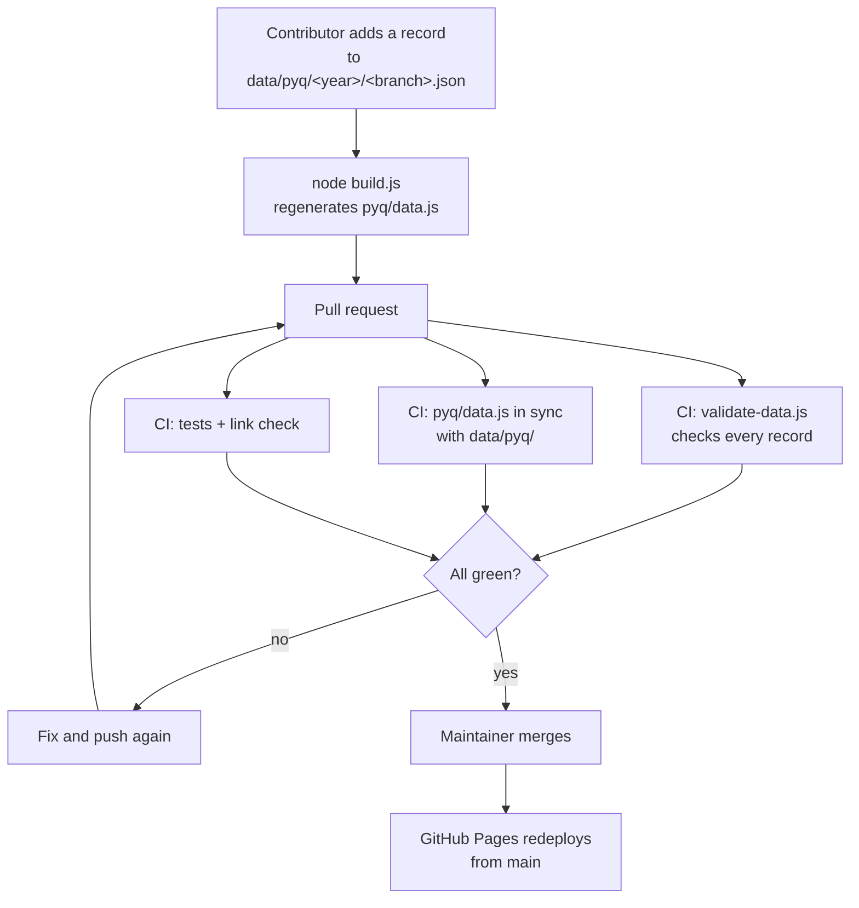

# college-materials

Open study materials for Manipal University Jaipur, maintained by
[Accelerate](https://github.com/accelerate-muj) and contributed by students. Everything here is a
file in a public Git repository — no login, no ads, no upload quota, nothing that expires when
somebody's Drive fills up.

**Browse it: [accelerate-muj.github.io/college-materials](https://accelerate-muj.github.io/college-materials/)**

## What's here

### Past Year Question Papers

Mid-term and end-term papers, organised the way you'd actually look for them — by year of study,
then by branch.

| Year | Split by |
|---|---|
| First Year | Nothing — the first-year curriculum is common to every branch |
| Second Year | Branch (14 sections: CSE, CSE specialisations, IT, CCE, ECE, EE, ME, CE, Mechatronics, Biotechnology, Chemical) |
| Third Year | Branch, same list |
| Fourth Year | Branch, same list |

**[Open the archive →](https://accelerate-muj.github.io/college-materials/pyq/)**

The archive is empty until people contribute to it. Adding a paper is one JSON entry — see
[CONTRIBUTING.md](CONTRIBUTING.md).

## Running it locally

Double-click `index.html`. There is no build step and nothing to install.

The one thing that needs Node is regenerating the archive after you edit the data:

```bash
node build.js                            # data/pyq/ -> pyq/data.js
node .github/scripts/validate-data.js    # the same check CI runs
node tests/run.js                        # no npm install — there are no dependencies
node build-fonts.js                      # only if you changed a font file
```

No Node? The test suite also runs by opening `tests/index.html` in a browser, and the club's
[Git guide](https://accelerate-muj.github.io/resources/git-guide/) covers the rest.

## Layout

```
index.html               Landing page
style.css                The design system, applied — see DESIGN.md
pyq/
  index.html             The archive: year -> branch -> papers
  app.js                 Hash routing and rendering
  data.js                Generated — the baked archive the page reads (window.PYQ_DATA)
src/
  pyq.js                 Pure rules: what a valid paper is, how papers sort and group
data/pyq/                Source of truth — see data/pyq/README.md
  catalogue.json         Years and branches. Editing this is how you add a section.
  first-year/common.json
  second-year/<branch>.json
papers/                  Committed PDFs, for papers not hosted anywhere stable
assets/fonts/            Self-hosted faces (SIL OFL) + generated fonts.css
build.js                 data/pyq/ -> pyq/data.js
build-fonts.js           assets/fonts/*.woff2 -> assets/fonts/fonts.css
tests/                   Dependency-free suite; runs in Node or a browser
.github/
  scripts/validate-data.js   CI check over every committed record
  workflows/ci.yml           Tests, data integrity, link check
```

`src/pyq.js` holds pure logic — no DOM, no filesystem, no shared state — which is what lets the
build script, the CI validator, the tests and the site all defer to one definition of "a valid
paper" instead of four that drift apart. [ARCHITECTURE.md](ARCHITECTURE.md) explains why it's
shaped this way; [CHANGELOG.md](CHANGELOG.md) tracks what changed.

## Design

The site is the reference implementation of the club's visual system — black, crimson, white;
condensed uppercase for display; monospace wherever the interface quotes a machine.
**[DESIGN.md](DESIGN.md) documents the tokens, the type rules, the motifs and the accessibility
rules that are part of the system.** Read it before changing `style.css`, and copy it into other
club repos that need to look like they belong to the same organisation.

Fonts are self-hosted and embedded as data URIs — there is no Google Fonts link and no CDN. That's
deliberate: no external dependency, nothing leaked to a third party, and the type still renders when
you open the page over `file://`.

### How a contribution flows



## Community health files

This repo does not ship its own `CODE_OF_CONDUCT.md`, `SECURITY.md`, `SUPPORT.md` or issue
templates. GitHub applies the organisation-wide copies in
[accelerate-muj/.github](https://github.com/accelerate-muj/.github) automatically, and a local copy
would only drift out of date. The club's
[Constitution](https://github.com/accelerate-muj/.github/blob/main/CONSTITUTION.md) and
[Governance summary](https://github.com/accelerate-muj/.github/blob/main/GOVERNANCE.md) live there
too.

## Licensing and the papers themselves

The site code, the data files and the documentation in this repository are licensed
[CC BY-SA 4.0](LICENSE), matching the club's other content repository,
[`resources`](https://github.com/accelerate-muj/resources).

**That licence does not extend to the question papers.** Those are set and owned by Manipal
University Jaipur. This archive indexes and mirrors them so its own students can revise from them;
it claims no copyright over them and grants no rights in them. If you hold rights in something here
and want it removed, [open an issue](https://github.com/accelerate-muj/college-materials/issues/new/choose)
or email `accelerate.muj@gmail.com` and it will be taken down without argument.

Prefer linking a paper (`url`) over committing a PDF (`file`) where a stable link exists — it keeps
the repository small and the takedown surface smaller.
